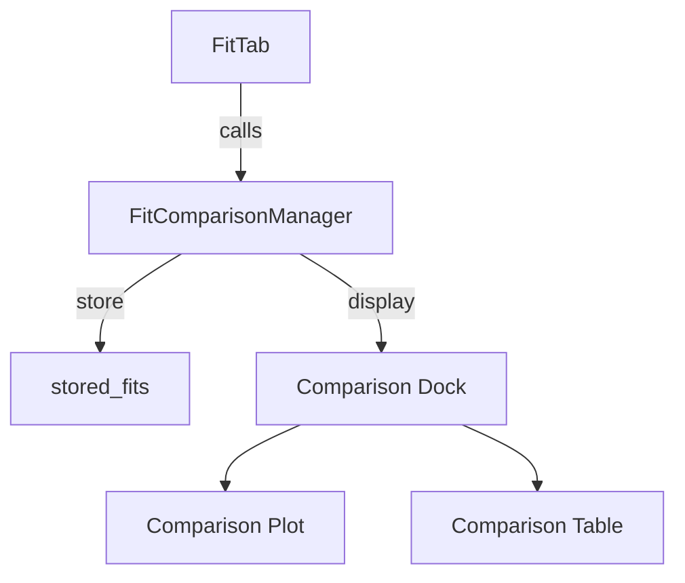

## `FitComparisonManager`

This class handles the storage, display, and export of multiple fitting results for comparison. It is used from within a `FitTab` to enable model benchmarking and result visualization.

---

### Role in the Application

* Attached to each `FitTab` instance.
* Activated via the toolbar ("Compare" action).
* Stores all fit results (only 1D).
* Provides a dock with:

  * A matplotlib plot showing all selected models
  * A table listing fit parameters and scores
  * A list to rename, enable/disable individual fits
  * A CSV export button

---

### Comparison Flow



---

### Stored Data

Each entry in `stored_fits` is a dict containing:

```python
{
    "formula": str,
    "method": str,  # "lmfit", "odr", "emcee"
    "params": lmfit.Parameters or dict,
    "aic": float,
    "bic": float,
    "rmse": float,
    "r_squared": float,
    "chi_square": float,
    "reduced_chi_square": float,
}
```

---

### Supported Strategies

* **1D Fit:** Overlays different model predictions on a scatter plot of `X, Y`.
* **Fit per Y (multi-1D):** Recomputes predictions for each `Y` slice, plots curves on `X, Z`.

---

### Key Methods

| Method                     | Description                                                    |
| -------------------------- | -------------------------------------------------------------- |
| `store_current_fit()`      | Saves the current model result to internal list                |
| `toggle_comparison_mode()` | Shows/hides the comparison interface                           |
| `create_comparison_ui()`   | Builds dock with plot, list, table, and export button          |
| `redraw_comparison_plot()` | Redraws model predictions over data depending on selected fits |
| `export_comparison_csv()`  | Saves all stored results to a CSV file                         |
| `reset()`                  | Clears all stored data and disables comparison mode            |

---

### Dependencies

* Requires `fit_tab.plot_widget.result` to be set.
* Uses `parse_formula()` to dynamically recreate fit functions for plotting.
* Compatible with both `lmfit.ModelResult` and custom dicts from `emcee`/`odr`.
