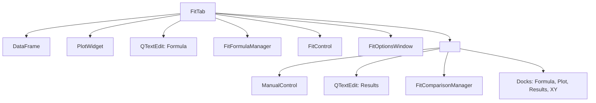

# `FitTab`

This page documents the `FitTab` class, which represents the main workspace for fitting a single dataset. It integrates all relevant dock widgets (formula, data, results, fit control) and connects user interactions with core fitting components such as `FitControl`, `PlotWidget`, and `FitFormulaManager`.

---

## Role in the Application

* Represents one dataset and one fitting session
* Hosts the plot, data display, formula editor, and fit options
* Manages layout and visibility of all dockable panels
* Provides access to smoothing and weighting tools
* Delegates fit execution to `FitControl`, and rendering to `PlotWidget`

---

## Structure Diagram

---

## Responsibilities

* Stores and validates the current dataset (`self.df`)
* Detects and adapts to 1D or 2D data modes
* Provides the dock layout for formula, results, and data views
* Applies smoothing and weighting methods to raw data
* Coordinates formula input, fit options, and comparison manager
* Triggers plot updates (but does not directly execute fits)

---

## Attributes

| Attribute            | Type                   | Description                                |
| -------------------- | ---------------------- | ------------------------------------------ |
| `df`                 | `pd.DataFrame`         | Loaded data for this tab                   |
| `plot_widget`        | `PlotWidget`           | Shared widget for plotting                 |
| `formula_text`       | `QTextEdit`            | Formula editor                             |
| `formula_manager`    | `FitFormulaManager`    | Parses and manages formula state           |
| `fit_control`        | `FitControl`           | Dock for selecting and launching fit       |
| `fit_options_dialog` | `FitOptionsWindow`     | Modal dialog to define fit parameters      |
| `manual_control`     | `ManualControl`        | Optional dock for manual parameter input   |
| `comparison_manager` | `FitComparisonManager` | Manager for multi-model comparison         |
| `results_text`       | `QTextEdit`            | Area displaying textual fit report         |
| `dock_formula`       | `BaseDockWidget`       | Dock containing formula editor and buttons |
| `dock_plot`          | `BaseDockWidget`       | Dock containing the main plot              |
| `dock_results`       | `BaseDockWidget`       | Dock showing the fit report                |
| `dock_xy`            | `BaseDockWidget`       | Dock showing raw X/Y/Z data in a table     |

---

## Grouped Methods in `FitTab`

### 1. Initialization and Setup

| Method                | Role                                       |
| --------------------- | ------------------------------------------ |
| `__init__()`          | Constructs widgets, docks, and assigns IDs |
| `initUI()`            | Calls individual dock initializers         |
| `init_plot_dock()`    | Adds main plot area                        |
| `init_formula_dock()` | Creates formula editor and buttons         |
| `init_results_dock()` | Prepares the results panel                 |
| `init_xy_dock()`      | Builds the table for data display          |

---

### 2. Data Loading and Validation

| Method                         | Role                                        |
| ------------------------------ | ------------------------------------------- |
| `load_data_into_tab(df, path)` | Injects new data, configures mode (1D/2D)   |
| `_load_1d_data(df)`            | Prepares table and plot for X/Y data        |
| `_load_2d_data(df)`            | Prepares table and plot for X/Y/Z data      |
| `clear_data()`                 | Removes data and resets UI                  |
| `_cleanup_manual_control()`    | Removes manual dock when switching datasets |

---

### 3. Fit and Formula Management

| Method                        | Role                                              |
| ----------------------------- | ------------------------------------------------- |
| `update_fit_options_params()` | Updates param table in Fit Options dialog         |
| `open_fit_options()`          | Opens the Fit Options modal and stores selections |
| `show_fit_results()`          | Makes fit panel and result label visible          |
| `update_results_text(report)` | Sets text of the result dock                      |

---

### 4. Smoothing and Weighting

| Method                | Role                                    |
| --------------------- | --------------------------------------- |
| `smooth_data(method)` | Applies smoothing to Y data and replots |
| `weight_data(method)` | Applies error weighting before fit      |

---

### 5. Miscellaneous

| Method                 | Role                                    |
| ---------------------- | --------------------------------------- |
| `create_xy_table()`    | Creates raw table widget for XY(Z) data |
| `get_fit_name()`       | Returns label like `"Fit 1"`, `"Fit 2"` |
| `show_error_message()` | Displays a blocking error message popup |

---

## Notes on Execution Flow

Although `FitTab` does not contain a `run_fit()` method, it integrates all components required for launching a fit via the `FitControl` dock. The actual fit is delegated to `FitProcessor` from within the dock logic.

---

## Related Modules

| Module              | Role                                      |
| ------------------- | ----------------------------------------- |
| `fit_processor.py`  | Executes actual fit calls (lmfit, etc.)   |
| `plot_widget.py`    | Backend for visualizing data + fit        |
| `fit_formula.py`    | Parses formula and extracts parameters    |
| `fit_control.py`    | UI and logic for fit strategy and trigger |
| `fit_comparison.py` | Manages comparison across fits            |

