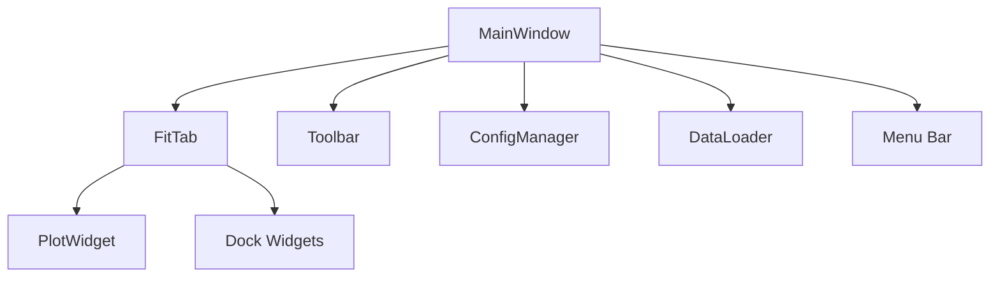

# Application Entry and Main Window

This document describes the responsibilities and structure of the `MainWindow` class, which serves as the central controller of the user interface. It manages tabs, toolbars, menus, layout state, and forwards loaded data to the active tab. While it plays a crucial structural role, it delegates all domain-specific logic (e.g. fitting, plotting) to components like `FitTab`.

> The class is currently very large and tightly coupled. It would benefit from a future refactoring to isolate responsibilities more clearly.

---

## Role of `MainWindow`

- Hosts all top-level UI components (toolbar, menus, tabs)
- Creates and switches between tabs (`FitTab`, etc.)
- Manages global application layout and dock visibility
- Handles file I/O operations through menu actions
- Injects loaded data into the current tab

---

## System Diagram



---

## UI Initialization

```python
class MainWindow(QMainWindow):
    def __init__(self):
        self.config = ConfigManager()
        self.setFixedSize(...)
        self._init_interface()
```

All core components (menu bar, toolbar, tab container, status bar) are initialized once in `_init_interface()`. A first `FitTab` is created by default.

---

## Tab Lifecycle

Tabs are created using `add_fit_tab()` and inserted into the central `QTabWidget`. When the user switches tabs, the View menu is rebuilt to reflect the correct dock widgets and toolbar state.

```python
plot_widget = PlotWidget(self)
new_tab = FitTab(self, plot_widget)
self.tabs.addTab(new_tab, new_tab.get_fit_name())
```

---

## Dock Visibility and View Menu

Each tab manages its own docks (fit panel, plot, results...). The `MainWindow` maintains a mapping of visible docks and their associated menu actions for each tab:

```python
self.view_actions_per_tab[tab] = {
    "Fit Formula": (action, dock),
    ...
}
```
When switching tabs, the view menu is cleared and rebuilt accordingly.

---
## Grouped Methods in `MainWindow`

The table below categorizes each method by role.

### 1. Initialization

| Method              | Role                                          |
| ------------------- | --------------------------------------------- |
| `__init__()`        | Reads config and initializes main UI layout   |
| `_init_interface()` | Builds toolbar, menus, status bar, tab system |

---

### 2. Menu Setup

| Method              | Role                                   |
| ------------------- | -------------------------------------- |
| `_init_file_menu()` | Creates File menu: Load, Export, Exit  |
| `_init_fits_menu()` | Adds New/Close Fit actions             |
| `_init_view_menu()` | Connects menu items to dock visibility |

---

### 3. Tab Management

| Method                  | Role                                         |
| ----------------------- | -------------------------------------------- |
| `add_fit_tab()`         | Creates a new `FitTab` and activates it      |
| `get_current_fit_tab()` | Returns active `FitTab` or `None`            |
| `close_fit_tab(index)`  | Closes tab at the given index                |
| `rename_tab(index)`     | Renames tab via inline `QLineEdit`           |
| `duplicate_tab(index)`  | Copies data, formula, and options to new tab |

---

### 4. View State & Docks

| Method                                       | Role                                       |
| -------------------------------------------- | ------------------------------------------ |
| `_update_view_menu_for_current_tab()`        | Rebuilds View menu when tab changes        |
| `_init_view_menu()`                          | Registers visibility toggles for tab docks |
| `restore_default_view()`                     | Restores all docks in current tab          |
| `_snapshot_dock_states_before_switch(index)` | Saves dock state before tab switch         |

---

### 5. Toolbar State

| Method                            | Role                                         |
| --------------------------------- | -------------------------------------------- |
| `enable_toolbar_buttons(enabled)` | Enables/disables toolbar buttons after a fit |
| `_snapshot_toolbar_state(tab)`    | Records which toolbar buttons are enabled    |
| `_restore_toolbar_state(tab)`     | Re-applies the saved toolbar state           |

---

### 6. Data I/O

| Method                    | Role                               |
| ------------------------- | ---------------------------------- |
| `load_data_from_menu()`   | Loads data via file dialog         |
| `load_previous_data()`    | Loads last accessed file           |
| `_inject_data_into_tab()` | Injects DataFrame into current tab |
| `unload_data()`           | Clears data from the current tab   |
| `export_data()`           | Exports current data to CSV        |

---

### 7. Status

| Method          | Role                               |
| --------------- | ---------------------------------- |
| `show_status()` | Displays message in the status bar |

---

### 8. App Entry Point

| Method   | Role                          |
| -------- | ----------------------------- |
| `main()` | Entry point to launch the app |

---

## Connected Modules

| Component       | Description                        |
| --------------- | ---------------------------------- |
| `FitTab`        | Main per-dataset fit interface     |
| `Toolbar`       | Global toolbar shared across tabs  |
| `PlotWidget`    | Rendering backend used by each tab |
| `ConfigManager` | Manages saved layout, window size  |
| `DataLoader`    | Handles file selection and parsing |

---

## Notes

This class is currently responsible for too many aspects of the interface: tab lifecycle, dock logic, toolbar state, file handling, and persistence.
Future work could separate:

* Tab creation logic
* Menu construction
* Toolbar state tracking
* Layout state into a controller class