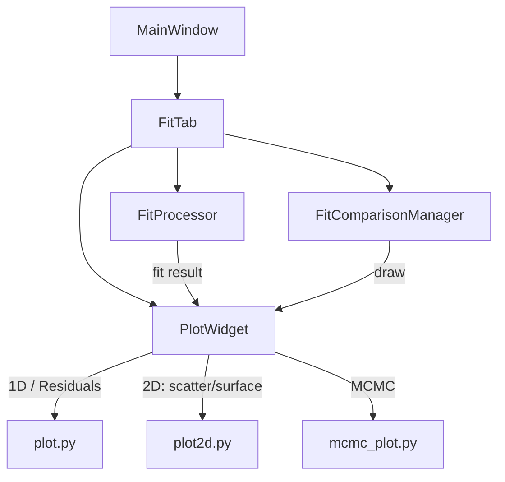

# Plot System Overview

This page summarizes all plotting components used in the application. It includes 1D fits, multi-1D fits, 2D surface fits, confidence bands, residuals, MCMC diagnostics, and model comparison.

---

## Global Plot Architecture

---

## 1. 1D Fit Plots (`plot.py`)

These are methods or utilities used for plotting raw 1D data, fitted curves, residuals, and confidence intervals.

| Function / Method                       | Description                             | Location           |
| --------------------------------------- | --------------------------------------- | ------------------ |
| `PlotWidget.plot_data(df)`              | Plots raw 1D data (X, Y)                | `plot.py`          |
| `PlotWidget.plot_fit(x, y)`             | Plots fitted curve on top of data       | `plot.py`          |
| `PlotAnalysis.toggle_residuals_plot()`  | Toggles residuals plot (Y - fit)        | `plot_analysis.py` |
| `PlotAnalysis.toggle_confidence_band()` | Toggles display of confidence intervals | `plot_analysis.py` |

---

## 2. Multi-1D Fit (Fit per Y) (`plot2d.py`)

Plots used when performing a fit Z = f(X, Y\_fixed) for multiple Y values.

| Function                                                | Description                            | Location           |
| ------------------------------------------------------- | -------------------------------------- | ------------------ |
| `plot_multi1d_data(ax, canvas, x, y, z, pw)`            | Plots raw grouped data                 | `plot2d.py`        |
| `plot_multi1d_fit(ax, canvas, fits, pw)`                | Overlays fitted curves Z=f(X,Y\_fixed) | `plot2d.py`        |
| `PlotAnalysis.toggle_confidence_band()`             | Confidence bands over Y slices         | `plot_analysis.py` |
| `PlotAnalysis.toggle_residuals_plot()` (mode: multi 1D) | Residual plots per Y                   | `plot_analysis.py` |

---

## 3. 2D Surface Fit (`plot2d.py`)

Used for true 2D fits where Z = f(X, Y), showing surface and contour.

| Function                                            | Description                               | Location           |
| --------------------------------------------------- | ----------------------------------------- | ------------------ |
| `plot_2d_series(x, y, z, strategy)`                 | Raw Z data as scatter grouped by strategy | `plot2d.py`        |
| `plot_2d_surface_fit(ax, canvas, x, y, z, fit, pw)` | Fitted surface + 3D view + contour        | `plot2d.py`        |
| `PlotAnalysis.plot_conf_interval_2d()`              | Confidence region for surface fit         | `plot_analysis.py` |

---

## 4. MCMC Diagnostic Plots (`mcmc_plot.py`)

Generated after a successful fit with `emcee`.

| Function / Method                       | Description                                | Location       |
| --------------------------------------- | ------------------------------------------ | -------------- |
| `MCMCPlot.show_mcmc_results(...)`       | Dispatches the diagnostic plots            | `mcmc_plot.py` |
| `MCMCPlot.plot_walkers(...)`            | Shows evolution of walker chains per param | `mcmc_plot.py` |
| `MCMCPlot.plot_corner(...)`             | Displays parameter correlations (corner)   | `mcmc_plot.py` |
| `MCMCPlot.plot_autocorrelation(...)`           | Autocorrelation of each parameter chain    | `mcmc_plot.py` |
---

## 5. Comparison Plot (`fit_comparison.py`)

Plots used in comparison mode to overlay stored fits.

| Function / Method                               | Description                       | Location            |
| ----------------------------------------------- | --------------------------------- | ------------------- |
| `FitComparisonManager.redraw_comparison_plot()` | Rebuilds the fit overlay plot     | `fit_comparison.py` |
| `FitComparisonManager.create_comparison_plot()` | Initializes the matplotlib canvas | `fit_comparison.py` |

---

## 6. Manual Fit Mode

In manual mode (sliders), the same plot functions are reused.

| Function / Method           | Description                     | Location  |
| --------------------------- | ------------------------------- | --------- |
| `PlotWidget.plot_data(df)`  | Raw data (X, Y)                 | `plot.py` |
| `PlotWidget.plot_fit(x, y)` | Manual fit preview from sliders | `plot.py` |
