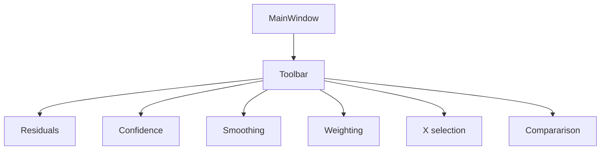

# Toolbar

This page documents the `Toolbar` class, which defines and manages all global user actions accessible via the top toolbar. These include launching a fit, toggling visual layers (residuals, confidence bands), and selecting fitting options such as method, smoothing, or weighting.

The toolbar is created once by `MainWindow`, and emits Qt signals when the user interacts with it.

## Structure Diagram


---

## Responsibilities

* Provides buttons for toggling residuals, confidence bands, components
* Includes menus for smoothing and weighting options
* Connects to `FitTab` and `PlotWidget` to trigger visual updates
* Adds or compares fit results across multiple runs

---

## Actions and Menus

| Action/Menu         | Type      | Icon          | Description                              |
| ------------------- | --------- | ------------- | ---------------------------------------- |
| `toggle_confidence` | QAction   | `conf_1d.png` | Show 99% confidence band (1D fit)        |
| `toggle_residuals`  | QAction   | `resi.png`    | Show residuals (data - fit)              |
| `toggle_components` | QAction   | `decomp.png`  | Show component contributions             |
| `toggle_conf_2d`    | QAction   | `conf_2d.png` | Show 2D confidence region (e.g. ellipse) |
| `set_xmin_xmax`     | Checkable | text only     | Select X-range for fit                   |
| `smoothing_menu`    | QMenu     |               | Gaussian, Moving Average, None           |
| `weighting_menu`    | QMenu     |               | x\_err, y\_err, xy\_err, none            |
| `add_fit`           | QAction   | none          | Add current fit to comparison list       |
| `toggle_comparison` | Checkable | none          | Enable comparison mode                   |

---

## Signal Flow

All logic is internal to the toolbar and calls back into `FitTab` or `PlotWidget`.

```python
self.toggle_residuals_action.triggered.connect(self.toggle_residuals)
self.smooth_gaussian_action.triggered.connect(lambda: self._apply_smoothing("savgol"))
```

---

## Integration with FitTab

| Called Method                                           | Purpose                 |
| ------------------------------------------------------- | ----------------------- |
| `tab.plot_widget.analysis_plot.toggle_residuals_plot()` | toggle residual display |
| `tab.weight_data("x_err")`                              | apply weighting method  |
| `tab.smooth_data("avg")`                                | apply smoothing method  |
| `tab.comparison_manager.store_current_fit()`            | save current result     |

---

## Related Files

* `toolbar.py`: UI structure and action handling
* `toolbar_actions.py`: (optional) separate logic if extracted
* `main_window.py`: connects toolbar to current tab
* `plot_analysis.py`: defines the toggleable plot elements
