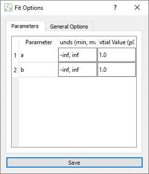
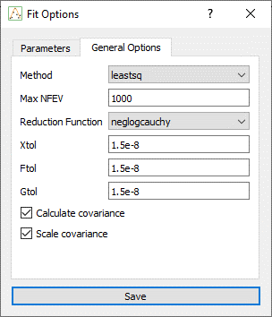
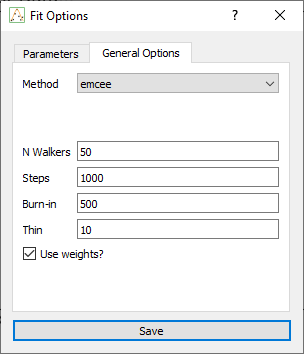

# Fit Options

The `Fit Options` dialog lets you configure all aspects of the fitting process, including method selection, parameter bounds, initial values, and optimizer-specific settings.

It is automatically populated from the current formula, extracting each parameter symbolically and allowing you to customize how each is treated during the fit.

## Fit Method

In the **General Settings** section, you can choose one of the following fitting methods:

  - **Levenberg-Marquardt** ([leastsq](https://docs.scipy.org/doc/scipy/reference/generated/scipy.optimize.leastsq.html))): Fast and commonly used for least-squares minimization.

  - **Orthogonal Distance Regression** ([odr](https://docs.scipy.org/doc/scipy/reference/odr.html
  )): Useful when both `x` and `y` have associated uncertainties.

  - **MCMC** ([emcee](https://emcee.readthedocs.io/en/stable/)): Bayesian sampling using Markov Chain Monte Carlo, returning posterior distributions.

Each method enables different controls and outputs.

## Parameters Table

This table lists all parameters extracted from the current formula. For each parameter, you can define:

| Setting           | Description                               |
| ----------------- | ----------------------------------------- |
| **Initial Value** | Starting guess used to initialize the fit |
| **Min / Max**     | Lower and upper bounds (e.g., 0 to 10)    |

These values are passed to the backend fitting engine and directly influence convergence.

## Optimizer-Specific Settings

Below the parameter table, method-specific options appear based on the selected algorithm.

### Levenberg-Marquardt (leastsq)

| Option               | Description                              |
| -------------------- | ---------------------------------------- |
| `calc_covar`         | Whether to compute the covariance matrix |
| `scale_covar`        | Whether to rescale the covariance output |
| `xtol / ftol / gtol` | Tolerances for convergence               |

These settings are passed to `scipy.optimize.leastsq()` via `lmfit`.

### MCMC (`emcee`):

| Option        | Description                                         |
| ------------- | --------------------------------------------------- |
| `nwalkers`    | Number of walkers (MCMC chains)                     |
| `steps`       | Total number of sampling steps                      |
| `burn`        | Burn-in steps to discard from the beginning         |
| `thin`        | Thinning factor to reduce autocorrelation           |
| `is_weighted` | Whether to include `y_err` or `sigma` in the likelihood |

These options control the behavior of the `emcee.EnsembleSampler`.

### Notes

  - The table updates automatically if the formula changes.

  - Bounds and initial values are used by all fit methods, including MCMC priors.

  - The fit options are saved per tab and reloaded when reopening a fit.