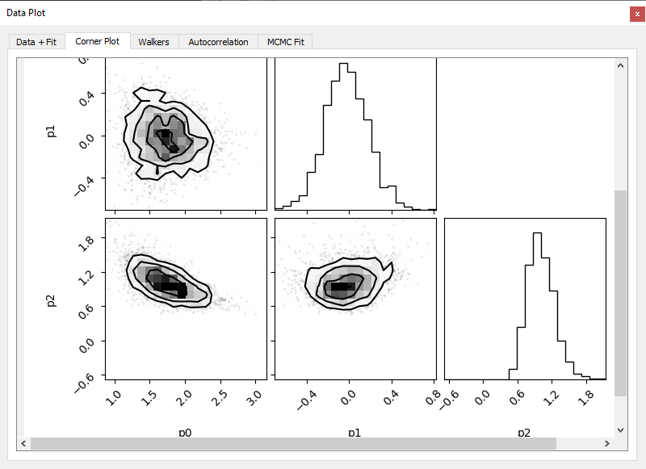
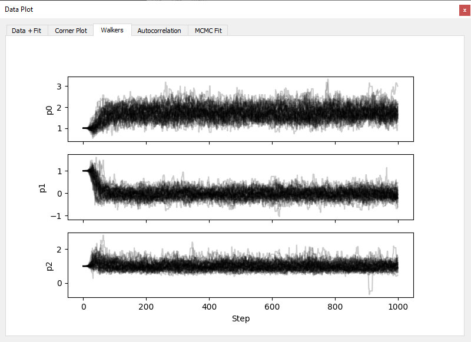
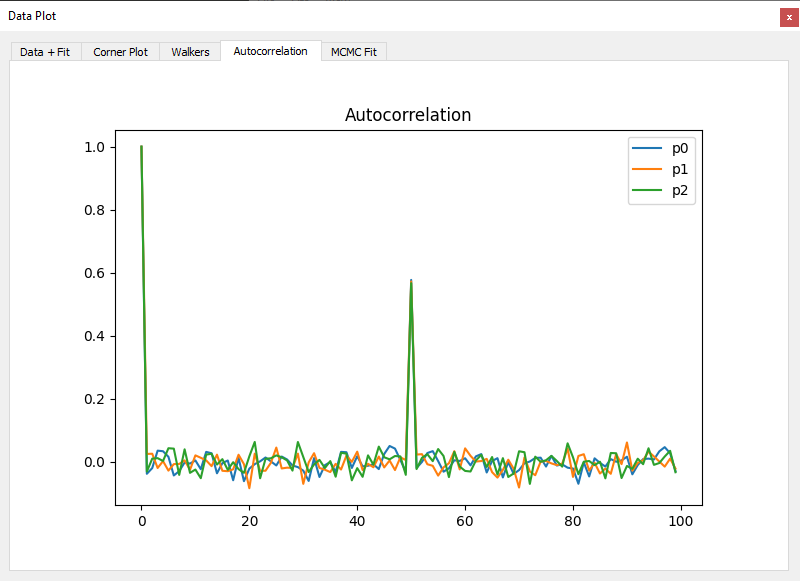

# MCMC Diagnostics and Visualization

When fitting a model using the **MCMC** method (via `emcee`), the application provides a set of dedicated plots and diagnostics tools to analyze the posterior distributions of the parameters.

## 1. MCMC Fit Plot

- Displays the median fit curve obtained from the posterior samples.
- A 99% confidence band (credible interval) is shown around the curve. 

## 2. Corner Plot

- Shows the marginal and joint distributions of all model parameters.
- Each subplot provides histograms (diagonal) and 2D scatter plots (off-diagonal).
- Useful to assess parameter correlations, asymmetry.

## 3. Walkers Plot

- Plots the value of each parameter across sampling steps for all walkers.
- Helps diagnose convergence and detect sampling issues (e.g., stuck walkers).
- Walkers should appear well-mixed and stable after the burn-in period.

## 4. Autocorrelation Plot

- Displays the autocorrelation time of each parameter.
- Allows evaluation of sampling efficiency and helps determine appropriate `thin` or `burn` settings.

## Notes
- All MCMC diagnostics are computed after discarding the burn-in period.
- If convergence is poor, consider increasing the number of walkers or steps.
- You can export posterior samples or corner plots from the toolbar menu.