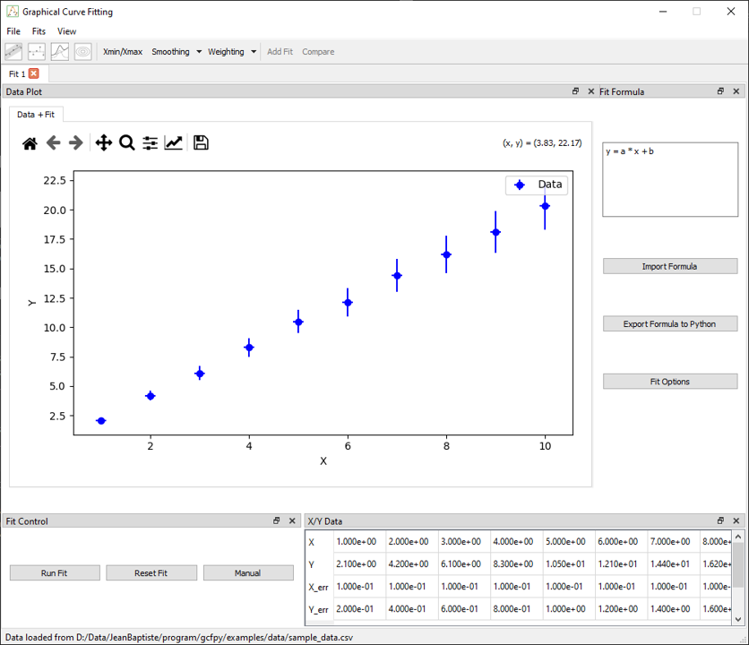
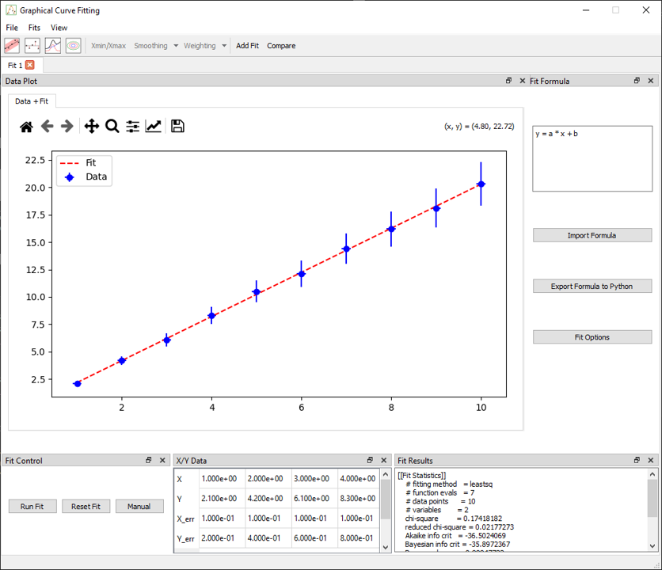

# Basic 1D Fit

This tutorial walks through the essential steps to perform a basic 1D fit using the **Graphical Curve Fit for Python** application. It is designed for first-time users to become familiar with the core workflow: loading data, defining a model, fitting, and analyzing the results.

---

## Step 1 – Load Example Data

1. Launch the application:
   ```bash
   gcfpy
   ```
2. Go to `File > Load Data`
3. Select the file:
   ```
   examples/data/linear.csv
   ```
4. Two docks will appear:
   * **X/Y Data**: showing the raw data
   * **Fit Control**: tools to launch and manage fits



---

## Step 2 – Enter a Fit Formula

A formula is automatically added to the **fit formula** dock:

```python
y = a * x + b
```

The application automatically extracts the parameters (`a`, `b`) and sets them up for fitting.

You may also use built-in functions like `sin`, `exp`, `log`, and physical constants such as `pi`, `e`, `h`, etc.

---

## Step 3 – Configure Fit Options (Optional)

Open the **Fit Options** dialog if you want to:

* Set initial guesses for `a` and `b`
* Define bounds
* Choose a different optimizer (default is `leastsq`)

This step is optional – default values will work for most basic examples.

---

## Step 4 – Run the Fit

Press the **Run Fit** button in the Fit Control dock

Upon completion, the following are updated:

* **Results Dock**: fitted values, standard errors, and metrics (AIC, BIC, RMSE, etc.)
* **Plot**: displays the best-fit line



