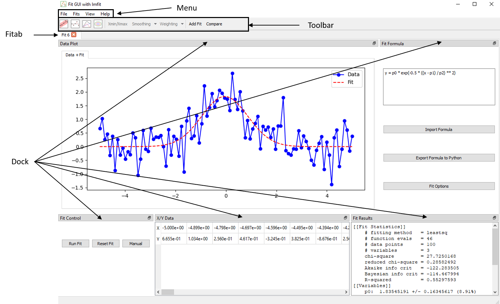

# Interface Overview

This section provides a general overview of the graphical user interface used for data fitting and analysis. The interface is composed of modular components, allowing users to efficiently load data, configure models, perform fits, and visualize results.

## Main Components

- **Application Window**  
  The main application container. It manages the overall layout, including tabs, toolbars, menus, and dockable gcfpy.widgets. It also handles file operations, global settings, and shortcuts.

- **Menus**
  At the top of the application window, the menu bar provides access to core functionality:
    - File: Load data from CSV files, create new tabs, or exit the application.
    - Fits: Add or close fit tabs.
    - View: Show or hide individual dock widgets (e.g., Fit Formula, X/Y Data), or restore the default layout.
    - Help: Open the user guide, documentation, or version information. (Not added)

- **Toolbar**  
  Located at the top of the application, the toolbar provides fast access to fitting and visualization tools such as :
    - Confidence interval toggles (1D and 2D)
    - Residual and decomposition views
    - Data selection
    - Data smoothing and weighting options
    - Fit comparison mode and controls

  These options adapt depending on the current tab’s mode (1D or 2D).

- **Fit Tabs**  
  Each tab is an independent fitting session. Within a tab, users can:
    - Load a dataset
    - Enter a symbolic formula
    - Select fitting method and options
    - View results

  Tabs are isolated from each other. You can work on multiple models or datasets in parallel without interference.

- **Docks**  
  Dockable widgets provide access to specialized features. These include:
    - Fit Formula: Symbolic formula editor with parameter auto-detection
    - Fit Control: Run the fit, inspect convergence and goodness of fit
    - Fit Results: Shows the fitted parameters, errors, and statistics
    - Manual Control: Allows manual adjustment of parameters with sliders and real-time updates to the fit.
    - Plot: Displays data, fit curves, confidence bands, and other visual elements depending on user selection
    - X/Y table: Table view of loaded dataset

## Plot Interaction

Each plot window includes standard navigation controls (zoom, pan, reset). Additional overlays such as residuals or confidence bands are controlled via the toolbar or fitting options.

## Fit Modes: 1D vs 2D

The interface adapts automatically to the dataset format:

  - 1D Mode: Requires columns X and Y. Plots are simple curves with optional error bars and confidence bands.
  - 2D Mode: Requires X, Y, and Z. Offers two strategies:
    - Fit per Y: Apply a 1D fit model to each group of Y
    - Fit Surface: Fit a global surface model Z = f(X, Y)

These modes determine the available fit strategies and visual outputs.

## Layout Management

The interface uses a fully dockable system:

  - All widgets (formula, plot, data) can be moved or detached

  - Panels can be hidden from the View menu

  - Layout is saved automatically between sessions

  - A default layout can be restored at any time

This flexibility allows users to arrange the workspace according to their workflow and screen size.