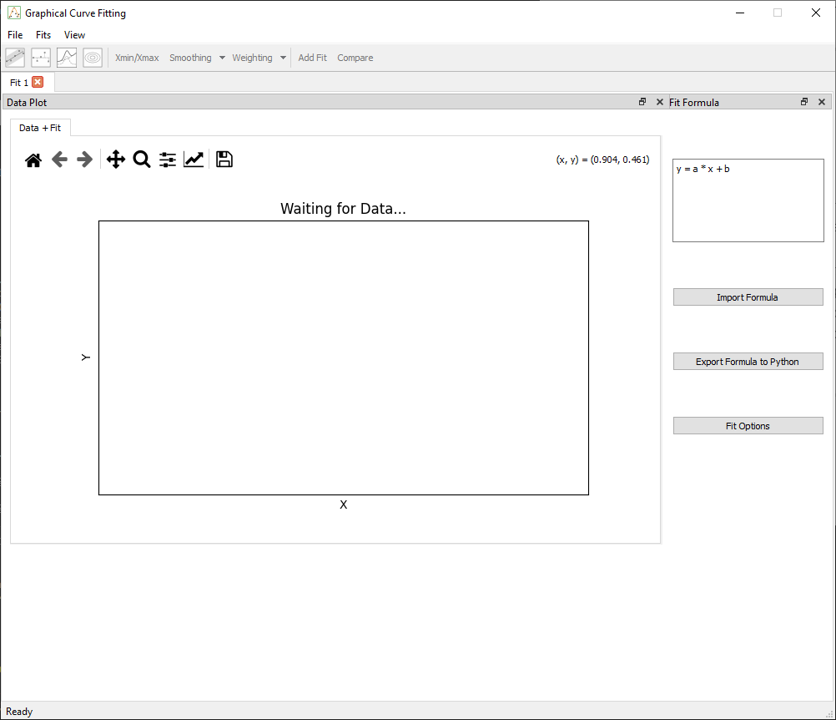
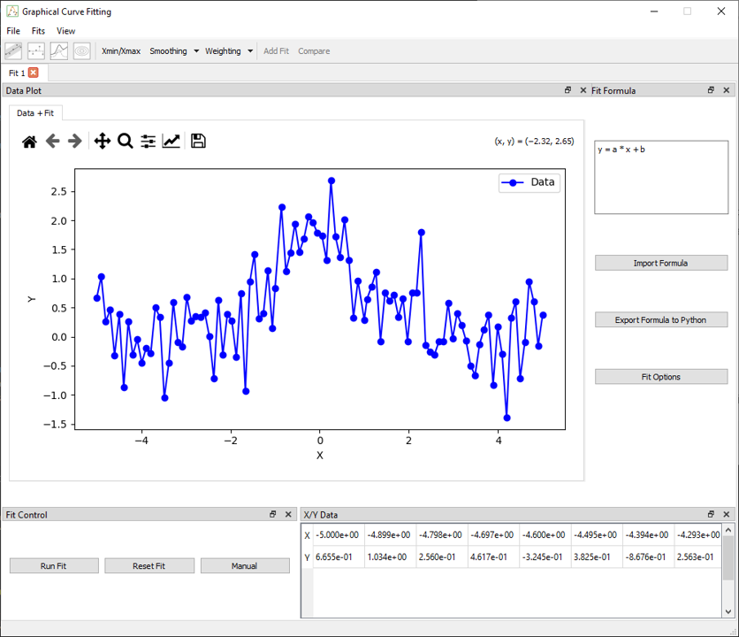
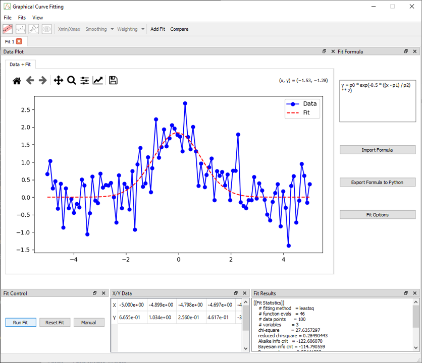

# Getting Started

## What is Graphical Curve Fit for Python ?

**Graphical Curve Fit for Python** is a graphical tool designed for scientists, engineers, and students to explore curve fitting strategies interactively.

Unlike libraries such as `lmfit`, `emcee`, or , `scipy.odr` this application is not a backend library. Instead, it offers a full graphical interface for visualising, adjusting, and comparing fits, especially when testing hypotheses, discovering models.

Behind the scenes, the fitting itself is handled by scientific libraries:

* [`lmfit`](https://lmfit.github.io/lmfit-py/) for least-squares optimization and model abstraction,
* [`scipy.odr`](https://docs.scipy.org/doc/scipy/reference/odr.html) for orthogonal distance regression,
* [`emcee`](https://emcee.readthedocs.io/) for Bayesian sampling using MCMC.

Graphical Curve Fit for Python acts as a frontend to these tools, with a focus on interactivity, model clarity, and visual output.

---

## Launching the Application

Once installed (see [Installation](install.md)), launch the application from your terminal:

```bash
gcfpy
```

You should see the main interface open within a few seconds.

---

## Default View on Launch



Upon startup, the application opens with:

* A **menu**  that allows you to load data, add tabs, and manage dock visibility,
* A **toolbar**  toggle plots and views of the fits, apply x selection, activate compare dock.
* A **Fit tab** (you can open multiple), each representing an independent session,
* Two **dock widgets**:

  * **Data Plot**: central plot of data and fitted models,
  * **Fit Formula**: input area for model equations,


---

## Basic Workflow

### 1. Load a Dataset

From the top menu, choose:

```
File > Load Data
```


Selecting a `.csv` file with at least `X` and `Y` columns is required. Optional columns such as `Z`, `X_err`, and `Y_err` are also supported. Some data are available in `examples/data`.


Once loaded:

* The **X/Y Data** dock is populated.
* The data appears in the **plot** area.
* Fit actions are enabled.



When data is loaded, two additional docks become visible:

* The **Fit Control** dock, which allows running the fit defined in the **Fit Formula** dock
* The **X/Y Data** dock, which displays the loaded dataset in table format

In the **toolbar**, several options become available:

* **Xmin/Xmax** selection to restrict the fit to a specific x-range
* **Smoothing** tools to process noisy data
* **Error handling** that automatically enables weighting if `X_err` or `Y_err` columns are present in the data


### 2. Enter a Formula

In the **Fit Formula** dock, enter your model using a Python-like syntax. For example:

```python
y = a * x + b
```

The application automatically extracts the parameters (`a`, `b`) and updates the fitting configuration. You can use mathematical functions like `sin`, `exp`, `log`, `abs`, and more.

Physical constants can also be added to the formula; see the list and syntax in [Fit Formula](../fit/fit_formula.md) 

Advanced options like importing/exporting formulas or editing them via GUI are also available.

### 3. Run the Fit

To perform a fit:

* Click the **Fit** button on the toolbar,
* Or open the **Fit Control** dock to select:

  * The fitting method (`Least Squares`, `ODR`, `MCMC`),
  * Parameter settings and bounds,
  * Weighting strategies.




Once the fit is complete:

* The result appears in the **Fit Results** dock,
* The fitted curve

In the toolbar, several options for different plots become available when the fit is made.
